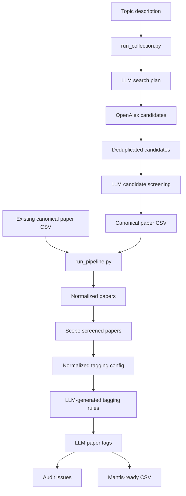

# Pipeline Summary

This document maps the repository's literature pipeline at a high level, with
code locations, inputs, outputs, tool calls, decision points, and hard-coded
prompt/config values.

## Refactor Update

The original script workflow is now preserved through compatibility wrappers in
`scripts/`, while reusable behavior lives under `ad_lit_pipeline/`. See
`docs/module_map.md` for the current script-to-module map.

Important changes from the original baseline:

- `configs/topics/early_detection_ad.yaml` is the first topic contract. It owns
  scope terms, screening policy, fallback policy, tagging categories, and
  enabled providers.
- `scripts/screen_scope.py` now preserves all input metadata columns and appends
  scope fields.
- Prompt text lives in `ad_lit_pipeline/prompts/templates/`.
- LLM calls go through `ad_lit_pipeline/llm/client.py` and can write traces.
- OpenAlex-specific logic lives in `ad_lit_pipeline/providers/openalex.py`.
- `scripts/run_pipeline.py` and `scripts/run_collection.py` delegate to package
  CLIs with `explain`, `--dry-run`, `--only-step`, `--from-step`, `--resume`,
  and run-manifest support.

## Top-Level Workflows

The repository has two main workflows:

1. Existing paper collection to Mantis CSV:
   `scripts/run_pipeline.py run --papers ... --tagging-config ... --collection ...`
2. Topic description to candidate paper collection, then into the main pipeline:
   `scripts/run_collection.py run --topic ... --collection ...`

## Shared Orchestration Behavior

- Main pipeline entrypoint: `scripts/run_pipeline.py:122`.
- Collection pipeline entrypoint: `scripts/run_collection.py:114`.
- Both orchestrators call child scripts through `run_command()` using
  `subprocess.run(..., check=True)` at `scripts/run_pipeline.py:12` and
  `scripts/run_collection.py:12`. If any step exits non-zero, the orchestrated
  pipeline stops immediately.
- Main pipeline processed outputs are named by `processed_path()` at
  `scripts/run_pipeline.py:18` as `data/processed/<collection>_<suffix>`.
- Collection raw outputs are named by `raw_path()` at `scripts/run_collection.py:18`
  as `data/raw/<collection>_<suffix>`, and the plan output is named by
  `plan_path()` at `scripts/run_collection.py:22`.

## Workflow A: Existing Papers To Mantis CSV

The main tagging/export pipeline is implemented by `run_full_pipeline()` at
`scripts/run_pipeline.py:22`. It creates the following derived paths at
`scripts/run_pipeline.py:23`:

- `data/processed/<collection>_papers_normalized.csv`
- `data/processed/<collection>_scope_screened.csv`
- `data/processed/<collection>_tagging_config_normalized.json`
- `data/processed/<collection>_tagging_rules.json`
- `data/processed/<collection>_extraction_filled.csv`
- `data/processed/<collection>_extraction_audit.csv`
- `data/processed/<collection>_mantis_ready.csv`

### Step A1: Normalize Paper Metadata

- Orchestrator call: `scripts/run_pipeline.py:31`.
- Implementation entrypoint: `scripts/normalize_metadata.py:123`.
- Key functions:
  - `validate_columns()` at `scripts/normalize_metadata.py:67`.
  - `normalize_row()` at `scripts/normalize_metadata.py:76`.
  - `read_and_normalize()` at `scripts/normalize_metadata.py:107`.
  - `write_rows()` at `scripts/normalize_metadata.py:114`.
- Tools/libraries called: Python `csv`, `re`, and `pathlib`.
- Input from previous step: the user-provided canonical paper CSV passed as
  `--papers` to `run_pipeline.py`.
- Output to next step:
  `data/processed/<collection>_papers_normalized.csv`.
- Output columns are hard-coded at `scripts/normalize_metadata.py:23`.

Decisions and splits:

- The input must contain the required columns hard-coded at
  `scripts/normalize_metadata.py:12`: `paper_id`, `title`, `year`, `doi`,
  `abstract`. Missing columns raise an error and stop the pipeline.
- Optional columns are hard-coded at `scripts/normalize_metadata.py:14`:
  `authors`, `venue`, `url`, `source`, `full_text_path`, `notes`.
- If `paper_id` is missing, `make_paper_id()` at
  `scripts/normalize_metadata.py:61` generates one from up to the first six
  title words plus the year, or `paper_0001` style fallback.
- `normalize_year()` at `scripts/normalize_metadata.py:48` extracts the first
  four-digit year it can find.
- `normalize_doi()` at `scripts/normalize_metadata.py:40` strips DOI URL/prefix
  forms like `https://doi.org/`, `http://doi.org/`, and `doi:`.
- `normalize_row()` records metadata notes for missing title, year, abstract,
  and full text path at `scripts/normalize_metadata.py:84`.

### Step A2: Rule-Based Scope Screening

- Orchestrator call: `scripts/run_pipeline.py:42`.
- Implementation entrypoint: `scripts/screen_scope.py:98`.
- Key functions:
  - `text_for_screening()` at `scripts/screen_scope.py:46`.
  - `decide_scope()` at `scripts/screen_scope.py:55`.
  - `write_rows()` at `scripts/screen_scope.py:88`.
- Tools/libraries called: Python `csv` and `pathlib`.
- Input from previous step:
  `data/processed/<collection>_papers_normalized.csv`.
- Output to later steps:
  `data/processed/<collection>_scope_screened.csv`.

Decisions and splits:

- `decide_scope()` searches only lower-cased title plus abstract.
- Exclude terms are checked before include terms, so exclude wins if both match.
- The possible `scope_decision` values are:
  - `exclude_or_route_elsewhere`: at least one exclude term matched.
  - `include`: no exclude term matched, and at least one include term matched.
  - `needs_decision`: no include or exclude term matched.
- The pipeline does not physically split files here. All rows go into the
  scope-screened CSV, but Step A5 only sends `include` rows to the LLM tagger.
- Important data-shape note: `OUTPUT_COLUMNS` at `scripts/screen_scope.py:33`
  keeps only `paper_id`, `title`, `year`, `doi`, `abstract`,
  `abstract_available`, `metadata_notes`, `scope_decision`, and `scope_reason`.
  Optional metadata from Step A1, such as authors, venue, source, url, and
  full text path, is dropped before the paper-tagging prompt sees it.

Hard-coded scope terms:

- Include terms at `scripts/screen_scope.py:11`: `early detection`,
  `early diagnosis`, `early dementia`, `mild cognitive impairment`, `mci`,
  `screening`, `classification`, `diagnosis`, `detecting`, `detection`.
- Exclude terms at `scripts/screen_scope.py:24`: `drug repurposing`,
  `drug discovery`, `treatment`, `treatment response`, `care support`.

### Step A3: Normalize Tagging Config

- Orchestrator call: `scripts/run_pipeline.py:53`.
- Implementation entrypoint: `scripts/normalize_tagging_config.py:109`.
- Key functions:
  - `load_config()` at `scripts/normalize_tagging_config.py:52`.
  - `normalize_config()` at `scripts/normalize_tagging_config.py:68`.
  - `normalize_category()` at `scripts/normalize_tagging_config.py:34`.
  - `normalize_values()` at `scripts/normalize_tagging_config.py:18`.
  - `write_output()` at `scripts/normalize_tagging_config.py:95`.
- Tools/libraries called: PyYAML, Python `json`, `re`, and `pathlib`.
- Input from user config:
  the YAML passed as `--tagging-config` to `run_pipeline.py`.
- Output to Steps A4, A5, and A6:
  `data/processed/<collection>_tagging_config_normalized.json`.

Decisions and splits:

- The config must be a YAML dictionary with `research_topic` and `categories`;
  otherwise it raises an error at `scripts/normalize_tagging_config.py:52`.
- `research_topic.title` and `research_topic.description` are required and
  non-empty at `scripts/normalize_tagging_config.py:77`.
- Each category must be a dictionary with a non-empty list of values. Invalid
  shapes raise errors at `scripts/normalize_tagging_config.py:34` and
  `scripts/normalize_tagging_config.py:18`.
- Category `required` defaults to `false` if omitted at
  `scripts/normalize_tagging_config.py:47`.
- Category `label` defaults to the category id with underscores replaced by
  spaces at `scripts/normalize_tagging_config.py:45`.
- Each allowed value becomes `{ "value": <value>, "label": <value> }` at
  `scripts/normalize_tagging_config.py:23`.

Hard-coded default config:

- The default config path is `configs/early_detection_tagging_config.yaml` at
  `scripts/normalize_tagging_config.py:113`.
- The checked-in early-detection config defines the research topic at
  `configs/early_detection_tagging_config.yaml:1`.
- It defines these category values:

| Category | Lines | Values |
| --- | --- | --- |
| `primary_clinical_target` | `configs/early_detection_tagging_config.yaml:9` | `ad`, `mci`, `dementia`, `cognitive_impairment`, `prodromal_ad`, `preclinical_ad`, `mixed_or_unclear`, `unclear` |
| `early_detection_subtype` | `configs/early_detection_tagging_config.yaml:20` | `early_ad_detection`, `mci_detection`, `mci_ad_detection`, `dementia_screening`, `prodromal_detection`, `preclinical_detection`, `conversion_or_deterioration_detection`, `mixed_or_unclear` |
| `population_scope` | `configs/early_detection_tagging_config.yaml:31` | `ad_vs_control`, `mci_vs_control`, `ad_vs_mci`, `ad_vs_mci_vs_control`, `dementia_vs_control`, `cognitive_impairment_vs_control`, `mci_conversion`, `multi_stage_early_disease`, `mixed_clinical`, `unclear` |
| `baseline_phase` | `configs/early_detection_tagging_config.yaml:44` | `healthy_or_control`, `subjective_complaint`, `mci`, `early_ad`, `mixed_early`, `not_phase_specific`, `not_reported`, `unclear` |
| `comparison_group_category` | `configs/early_detection_tagging_config.yaml:55` | `binary`, `multiclass`, `ordered_stage`, `conversion_prediction`, `screening_score`, `unclear` |
| `representation_type` | `configs/early_detection_tagging_config.yaml:64` | `categorical`, `continuum`, `both`, `unclear` |
| `evidence_modality_family` | `configs/early_detection_tagging_config.yaml:71` | `neuroimaging`, `speech_language`, `cognitive_assessment`, `clinical_tabular`, `fluid_biomarker`, `genetics_or_omics`, `sensor_behavior`, `eye_tracking`, `retinal_imaging`, `gait_motor`, `drawing_handwriting`, `eeg_or_signal`, `multimodal`, `unclear` |
| `signal_category` | `configs/early_detection_tagging_config.yaml:88` | `brain_structure`, `brain_function`, `brain_connectivity`, `pathology_biomarker`, `cognitive_profile`, `speech_language_pattern`, `clinical_demographic_profile`, `motor_behavior`, `digital_behavior`, `visuospatial_drawing_pattern`, `retinal_structure`, `genetic_molecular_profile`, `multimodal_biomarker_profile`, `unclear` |
| `dataset_source_type` | `configs/early_detection_tagging_config.yaml:105` | `public_named_dataset`, `private_or_local_clinical_dataset`, `challenge_dataset`, `simulated_or_synthetic`, `literature_or_secondary_data`, `not_reported`, `unclear` |
| `extraction_basis` | `configs/early_detection_tagging_config.yaml:115` | `title_only`, `abstract`, `abstract_and_metadata`, `full_text`, `unclear` |
| `knowledge_confidence` | `configs/early_detection_tagging_config.yaml:123` | `high`, `medium`, `low`, `very_low`, `conflict` |
| `review_status` | `configs/early_detection_tagging_config.yaml:131` | Required. Values: `ai_tagged`, `human_reviewed`, `needs_decision`, `full_text_needed`, `excluded_from_scope` |

### Step A4: Generate Fixed Tagging Rules With OpenAI

- Orchestrator call: `scripts/run_pipeline.py:64`.
- Implementation entrypoint: `scripts/generate_tagging_rules.py:215`.
- Key functions:
  - `load_dotenv()` at `scripts/generate_tagging_rules.py:57`.
  - `load_json()` at `scripts/generate_tagging_rules.py:70`.
  - `build_prompt()` at `scripts/generate_tagging_rules.py:101`.
  - `call_openai()` at `scripts/generate_tagging_rules.py:133`.
  - `validate_rules()` at `scripts/generate_tagging_rules.py:161`.
  - `write_output()` at `scripts/generate_tagging_rules.py:194`.
- Tools/libraries called: OpenAI Python SDK, OpenAI Responses API, Python
  `json`, `os`, and `pathlib`.
- Input from previous step:
  `data/processed/<collection>_tagging_config_normalized.json`.
- Output to Steps A5 and A6:
  `data/processed/<collection>_tagging_rules.json`.

Decisions and splits:

- The OpenAI model is `--model` if provided to this script; otherwise
  `OPENAI_MODEL`; otherwise `gpt-4o-mini` at
  `scripts/generate_tagging_rules.py:236`. `run_pipeline.py` does not pass a
  model flag, so the environment/default path is used.
- The LLM decides, for each category, whether selection should be `single` or
  `multi`, whether it is required, which fallback value to use, and the reason.
- The strict response schema is hard-coded in `RULE_RESPONSE_SCHEMA` at
  `scripts/generate_tagging_rules.py:27`. It requires exactly a top-level
  `rules` list, and each rule requires `category_id`, `selection`, `required`,
  `fallback_value`, and `reason`.
- `validate_rules()` rejects unknown categories, duplicate categories, missing
  categories, fallback values that are not allowed by the config, and attempts
  to make a config-required category optional.

Hard-coded prompt/system values:

- System message at `scripts/generate_tagging_rules.py:140`: generate stable
  ontology tagging rules as strict JSON.
- The user prompt at `scripts/generate_tagging_rules.py:101` tells the model:
  - Rules are generated once, frozen, and applied consistently to every paper.
  - Return exactly one rule per category.
  - Use only provided category ids and allowed values.
  - `fallback_value` must be one allowed value for that category.
  - Never use `unclear` unless it is explicitly listed.
  - Prefer `unclear` as fallback when allowed.
  - Use `mixed_or_unclear` if it is allowed and `unclear` is not.
  - Use `not_reported` when missing information is likely the issue.
  - For `knowledge_confidence`, use `very_low` as fallback.
  - For `review_status`, use `needs_decision` as fallback unless a better
    allowed value clearly applies.
  - Preserve required categories from the config.
  - Do not invent categories or values.

### Step A5: Tag Included Papers With OpenAI

- Orchestrator call: `scripts/run_pipeline.py:75`.
- Implementation entrypoint: `scripts/tag_papers_with_llm.py:251`.
- Key functions:
  - `read_included_papers()` at `scripts/tag_papers_with_llm.py:38`.
  - `build_response_schema()` at `scripts/tag_papers_with_llm.py:70`.
  - `paper_text()` at `scripts/tag_papers_with_llm.py:93`.
  - `build_prompt()` at `scripts/tag_papers_with_llm.py:107`.
  - `call_openai()` at `scripts/tag_papers_with_llm.py:143`.
  - `validate_tagged_row()` at `scripts/tag_papers_with_llm.py:177`.
  - `flatten_tagged_row()` at `scripts/tag_papers_with_llm.py:222`.
  - `write_rows()` at `scripts/tag_papers_with_llm.py:242`.
- Tools/libraries called: OpenAI Python SDK, OpenAI Responses API, Python
  `csv`, `json`, `os`, and `pathlib`.
- Inputs from previous steps:
  - Scope-screened papers from Step A2.
  - Normalized tagging config from Step A3.
  - Fixed tagging rules from Step A4.
- Output to Steps A6 and A7:
  `data/processed/<collection>_extraction_filled.csv`.

Decisions and splits:

- `read_included_papers()` keeps only rows where `scope_decision == "include"`
  at `scripts/tag_papers_with_llm.py:38`. Rows marked `exclude_or_route_elsewhere`
  or `needs_decision` are not sent to OpenAI and do not appear in the filled
  extraction CSV.
- The OpenAI model is `--model` if provided to this script; otherwise
  `OPENAI_MODEL`; otherwise `gpt-4o-mini` at `scripts/tag_papers_with_llm.py:282`.
  `run_pipeline.py` does not pass a model flag.
- `build_response_schema()` creates a strict dynamic JSON schema with
  `paper_id`, `main_knowledge_claim`, and one array field for every category in
  the normalized config.
- `validate_tagged_row()` rejects non-list category outputs, empty category
  outputs, invalid values, and single-selection categories with no resolvable
  single value.
- If a single-selection category returns more than one value, the validator
  silently keeps only the first value at `scripts/tag_papers_with_llm.py:200`.
- The intended fallback path for a missing single-selection value exists at
  `scripts/tag_papers_with_llm.py:202`, but an empty list is already rejected at
  `scripts/tag_papers_with_llm.py:191`, so empty single-selection outputs stop
  the script before that fallback branch can run.
- If there are zero included papers, this script can write an empty extraction
  file with headers. Step A7 later raises an error because it requires at least
  one row.

Hard-coded prompt/system values:

- System message at `scripts/tag_papers_with_llm.py:156`: tag scientific papers
  using fixed ontology rules as strict JSON.
- The paper prompt at `scripts/tag_papers_with_llm.py:107` tells the model:
  - Use only allowed category ids and values.
  - Return every category as an array.
  - For single-selection categories, return exactly one value.
  - For multi-selection categories, return one or more relevant values.
  - Use the category fallback value from fixed rules if there is not enough
    paper information.
  - Do not invent new values.
  - `main_knowledge_claim` must be one concise sentence describing the paper's
    contribution to the research topic.
  - Set `review_status` to `["ai_tagged"]` unless the paper clearly needs a
    human decision.

### Step A6: Audit Filled Extraction

- Orchestrator call: `scripts/run_pipeline.py:90`.
- Implementation entrypoint: `scripts/audit_extraction.py:135`.
- Key functions:
  - `allowed_values_by_category()` at `scripts/audit_extraction.py:35`.
  - `rules_by_category()` at `scripts/audit_extraction.py:45`.
  - `split_values()` at `scripts/audit_extraction.py:52`.
  - `audit_row()` at `scripts/audit_extraction.py:56`.
  - `summarize()` at `scripts/audit_extraction.py:105`.
  - `write_issues()` at `scripts/audit_extraction.py:123`.
- Tools/libraries called: Python `csv`, `json`, `collections.Counter`, and
  `pathlib`.
- Inputs from previous steps:
  - Filled extraction CSV from Step A5.
  - Normalized tagging config from Step A3.
  - Fixed tagging rules from Step A4.
- Output:
  `data/processed/<collection>_extraction_audit.csv`.

Decisions and splits:

- The auditor does not change extraction data. It creates an issue CSV and
  prints category value counts.
- It splits multi-values on semicolons at `scripts/audit_extraction.py:52`.
- It emits `required_missing` when a rule says a field is required and no value
  is present.
- It emits `invalid_value` for values outside the config's allowed values.
- It emits `single_selection_has_multiple_values` when a rule marks a category
  as `single` and the row has more than one semicolon-separated value.
- Audit findings do not stop the orchestrator. The next export step still runs
  unless this script itself crashes.

### Step A7: Export Mantis-Ready CSV

- Orchestrator call: `scripts/run_pipeline.py:105`.
- Implementation entrypoint: `scripts/export_mantis_ready.py:81`.
- Key functions:
  - `tag_columns()` at `scripts/export_mantis_ready.py:26`.
  - `make_semantic()` at `scripts/export_mantis_ready.py:38`.
  - `make_categoric()` at `scripts/export_mantis_ready.py:43`.
  - `export_row()` at `scripts/export_mantis_ready.py:56`.
  - `write_rows()` at `scripts/export_mantis_ready.py:72`.
- Tools/libraries called: Python `csv` and `pathlib`.
- Input from previous step:
  `data/processed/<collection>_extraction_filled.csv`.
- Final output:
  `data/processed/<collection>_mantis_ready.csv`.

Decisions and splits:

- If the filled extraction CSV has no rows, it raises an error at
  `scripts/export_mantis_ready.py:100`.
- `semantic` is the `main_knowledge_claim` if present; otherwise it falls back
  to the title at `scripts/export_mantis_ready.py:38`.
- `categoric` is the first semicolon-separated `early_detection_subtype` if
  present; otherwise the first `primary_clinical_target`; otherwise
  `uncategorized` at `scripts/export_mantis_ready.py:43`.
- `tag_columns()` excludes `paper_id`, `title`, `year`, `doi`, and
  `main_knowledge_claim` from the copied tag fields at
  `scripts/export_mantis_ready.py:26`.
- Core output columns are hard-coded at `scripts/export_mantis_ready.py:11`:
  `title`, `categoric`, `semantic`, `paper_id`, `year`, `doi`.

## Workflow B: Topic Collection To Canonical Paper CSV

The optional collection workflow is implemented by `run_collection()` at
`scripts/run_collection.py:26`. It creates the following outputs:

- `data/collection_plans/<collection>_plan.json`
- `data/raw/<collection>_openalex_candidates.jsonl`
- `data/raw/<collection>_openalex_candidates_deduped.jsonl`
- `data/raw/<collection>_candidate_screening.csv`
- `data/raw/<collection>_papers.csv`

At the end, it prints a suggested `run_pipeline.py run` command at
`scripts/run_collection.py:105`.

### Step B1: Plan Search With OpenAI

- Orchestrator call: `scripts/run_collection.py:33`.
- Implementation entrypoint: `scripts/plan_library_search.py:268`.
- Key functions:
  - `read_topic()` at `scripts/plan_library_search.py:183`.
  - `build_prompt()` at `scripts/plan_library_search.py:193`.
  - `call_openai()` at `scripts/plan_library_search.py:232`.
  - `write_output()` at `scripts/plan_library_search.py:260`.
- Tools/libraries called: OpenAI Python SDK, OpenAI Responses API, Python
  `json`, `os`, and `pathlib`.
- Input from user:
  `--topic` passed to `run_collection.py`.
- Output to next step:
  `data/collection_plans/<collection>_plan.json`.

Decisions and splits:

- `run_collection.py` always passes `--topic`; the underlying script also
  supports `--topic-file` at `scripts/plan_library_search.py:187`.
- The LLM chooses one of four providers in `PLAN_SCHEMA` at
  `scripts/plan_library_search.py:68`: `openalex`, `semantic_scholar`,
  `europe_pmc`, or `crossref`.
- This is a real branch point, but only the OpenAlex branch is implemented by
  the next script. If the LLM recommends any non-OpenAlex provider, Step B2
  raises an error and the collection workflow stops.
- `run_collection.py` passes `--max-results` and `--model` to this step at
  `scripts/run_collection.py:41`.
- The collection model default is hard-coded as `gpt-4o-mini` at
  `scripts/run_collection.py:124`.
- The plan script itself also falls back to `OPENAI_MODEL` or `gpt-4o-mini` at
  `scripts/plan_library_search.py:284`.

Hard-coded provider list and prompt values:

- The available providers and their supported filters are hard-coded in
  `PROVIDERS` at `scripts/plan_library_search.py:14`.
- System message at `scripts/plan_library_search.py:239`: create careful,
  inspectable digital-library search plans as strict JSON.
- The user prompt at `scripts/plan_library_search.py:193` tells the model:
  - Do not fetch papers.
  - Do not invent providers.
  - Prefer OpenAlex for broad cross-disciplinary topics.
  - Prefer Semantic Scholar for computer science, machine learning, AI, or
    citation-graph-heavy topics.
  - Prefer Europe PMC for biomedical, clinical, PubMed, or life-science-heavy
    topics.
  - Prefer Crossref only for DOI/publisher metadata lookup.
  - Extract year constraints, with examples for "all papers from 2018",
    "from 2018 to 2022", and "since 2020".
  - If no filter is mentioned, use null or empty arrays.
  - Make the main search string precise but not too narrow.
  - Add alternate search strings.
  - Use only provider-supported filters.
  - Treat the output as a plan for inspection, not a final API URL.

### Step B2: Fetch OpenAlex Candidates

- Orchestrator call: `scripts/run_collection.py:48`.
- Implementation entrypoint: `scripts/fetch_openalex_candidates.py:249`.
- Key functions:
  - `validate_openalex_plan()` at `scripts/fetch_openalex_candidates.py:236`.
  - `active_filters_from_plan()` at `scripts/fetch_openalex_candidates.py:95`.
  - `build_openalex_url()` at `scripts/fetch_openalex_candidates.py:121`.
  - `fetch_json()` at `scripts/fetch_openalex_candidates.py:149`.
  - `candidate_from_work()` at `scripts/fetch_openalex_candidates.py:160`.
  - `fetch_candidates()` at `scripts/fetch_openalex_candidates.py:198`.
  - `write_jsonl()` at `scripts/fetch_openalex_candidates.py:190`.
- Tools/libraries called: OpenAlex Works API over HTTPS, Python `urllib`,
  `json`, `time`, `datetime.date`, `re`, and `pathlib`.
- Input from previous step:
  `data/collection_plans/<collection>_plan.json`.
- Output to next step:
  `data/raw/<collection>_openalex_candidates.jsonl`.

Decisions and splits:

- The script only supports OpenAlex. `validate_openalex_plan()` rejects plans
  whose `recommended_provider` or `provider_specific_plan.provider` is not
  `openalex`.
- The OpenAlex API URL is hard-coded as `https://api.openalex.org/works` at
  `scripts/fetch_openalex_candidates.py:16`.
- Query text comes from `provider_specific_plan.query`, falling back to
  `main_search_string`, at `scripts/fetch_openalex_candidates.py:131`.
- `active_filters_from_plan()` currently converts only `year_from`, `year_to`,
  and `language` from the generic plan into OpenAlex filters. Other plan fields
  such as publication types, open access, abstract/full-text flags, venue, and
  domain are not used by this fetcher.
- Fetching stops when:
  - it has collected `max_results`;
  - OpenAlex returns no result list or an empty result list;
  - the API call fails and the script exits.
- `max_results` comes from the `run_collection.py --max-results` value. If the
  fetcher is run directly without `--max-results`, it uses the plan's
  `max_results_recommendation`, or 100 as a final fallback at
  `scripts/fetch_openalex_candidates.py:268`.
- Direct fetcher defaults are `--per-page 25`, `--mailto None`, and
  `--sleep 0.2` at `scripts/fetch_openalex_candidates.py:253`.
- It sends a hard-coded User-Agent,
  `ad-literature-knowledge-pipeline/0.1`, at
  `scripts/fetch_openalex_candidates.py:150`.

Output shape:

- Each JSONL row includes provider metadata, DOI, title, year, abstract,
  authors, venue, URL, query, rank, retrieval date, query URL, and raw OpenAlex
  record at `scripts/fetch_openalex_candidates.py:172`.
- Abstracts are rebuilt from OpenAlex's inverted index by
  `inverted_index_to_text()` at `scripts/fetch_openalex_candidates.py:37`.

### Step B3: Deduplicate Candidates

- Orchestrator call: `scripts/run_collection.py:61`.
- Implementation entrypoint: `scripts/deduplicate_candidates.py:118`.
- Key functions:
  - `read_jsonl()` at `scripts/deduplicate_candidates.py:13`.
  - `dedupe_key()` at `scripts/deduplicate_candidates.py:52`.
  - `candidate_sort_key()` at `scripts/deduplicate_candidates.py:84`.
  - `deduplicate()` at `scripts/deduplicate_candidates.py:94`.
  - `write_jsonl()` at `scripts/deduplicate_candidates.py:30`.
- Tools/libraries called: Python `json`, `re`, `pathlib`.
- Input from previous step:
  `data/raw/<collection>_openalex_candidates.jsonl`.
- Output to next step:
  `data/raw/<collection>_openalex_candidates_deduped.jsonl`.

Decisions and splits:

- Candidates are grouped by the first available dedupe key:
  - normalized DOI;
  - normalized title plus year;
  - normalized title;
  - provider plus provider id.
- Within each duplicate group, `candidate_sort_key()` prefers candidates with
  abstracts, then lower source rank.
- The representative row gains `dedupe_key`, `duplicate_count`, and
  `duplicate_provenance`.

### Step B4: Screen Candidates With OpenAI

- Orchestrator call: `scripts/run_collection.py:72`.
- Implementation entrypoint: `scripts/screen_candidates_with_llm.py:203`.
- Key functions:
  - `read_jsonl()` at `scripts/screen_candidates_with_llm.py:61`.
  - `make_paper_id()` at `scripts/screen_candidates_with_llm.py:78`.
  - `candidate_for_prompt()` at `scripts/screen_candidates_with_llm.py:97`.
  - `build_prompt()` at `scripts/screen_candidates_with_llm.py:110`.
  - `call_openai()` at `scripts/screen_candidates_with_llm.py:135`.
  - `screen_candidate()` at `scripts/screen_candidates_with_llm.py:172`.
  - `write_csv()` at `scripts/screen_candidates_with_llm.py:194`.
- Tools/libraries called: OpenAI Python SDK, OpenAI Responses API, Python
  `csv`, `json`, `os`, and `pathlib`.
- Inputs:
  - Deduplicated candidates from Step B3.
  - Original topic description from the user.
- Output to next step:
  `data/raw/<collection>_candidate_screening.csv`.

Decisions and splits:

- The strict response schema at `scripts/screen_candidates_with_llm.py:16`
  allows only `decision` values `include` or `exclude`, and confidence values
  `high`, `medium`, or `low`.
- `screen_candidate()` turns each candidate into a screening row with a
  generated `paper_id`.
- `make_paper_id()` prefers DOI, then provider id, then `candidate_0001` style
  fallback at `scripts/screen_candidates_with_llm.py:78`.
- `--limit` can truncate the candidate list for testing at
  `scripts/screen_candidates_with_llm.py:221`, but `run_collection.py` does not
  pass it.
- Included rows continue to Step B5. Excluded rows remain in the screening CSV
  but are not exported into the canonical paper CSV.

Hard-coded prompt/system values:

- System message at `scripts/screen_candidates_with_llm.py:142`: screen
  literature search candidates as strict JSON.
- The prompt at `scripts/screen_candidates_with_llm.py:110` tells the model:
  - `include` means directly about the topic and enough metadata to justify
    inclusion.
  - `exclude` means outside the topic, ambiguous, borderline, missing enough
    metadata, or would require human review.
  - Include computational/data-driven papers about early detection, screening,
    diagnosis, classification, prediction, or distinction of Alzheimer's
    disease, MCI, dementia, or related cognitive impairment.
  - Exclude treatment, drug discovery, care support, biology/mechanism discovery
    without detection, unrelated diseases, and missing-abstract candidates.
  - Exclude reviews if the topic asks for primary studies only.
  - Give one concise reason.

### Step B5: Export Included Candidates To Canonical CSV

- Orchestrator call: `scripts/run_collection.py:87`.
- Implementation entrypoint: `scripts/export_screened_candidates_to_csv.py:140`.
- Key functions:
  - `candidate_key()` at `scripts/export_screened_candidates_to_csv.py:59`.
  - `screening_key()` at `scripts/export_screened_candidates_to_csv.py:65`.
  - `make_notes()` at `scripts/export_screened_candidates_to_csv.py:71`.
  - `candidate_to_canonical_row()` at
    `scripts/export_screened_candidates_to_csv.py:92`.
  - `export_included()` at `scripts/export_screened_candidates_to_csv.py:111`.
  - `write_csv()` at `scripts/export_screened_candidates_to_csv.py:50`.
- Tools/libraries called: Python `csv`, `json`, and `pathlib`.
- Inputs from previous steps:
  - Deduplicated candidates from Step B3.
  - Candidate screening CSV from Step B4.
- Output:
  `data/raw/<collection>_papers.csv`, which is the canonical paper CSV input
  expected by Workflow A.

Decisions and splits:

- `export_included()` skips every screening row whose `screening_decision` is
  not `include`.
- It matches included screening rows back to candidates by `(doi, provider_id)`.
  If an included row cannot be matched, it raises an error.
- Output columns are hard-coded at `scripts/export_screened_candidates_to_csv.py:13`.
- `source` is set to `collected:<provider>`.
- `full_text_path` is always blank.
- `notes` captures provider, provider id, source rank, retrieval date,
  screening confidence, screening reason, and dedupe metadata when present.

## Optional Pre-Pipeline Importers

These scripts are not called by `run_pipeline.py` or `run_collection.py`, but
they convert external formats into the canonical CSV expected by Step A1.

### BibTeX Importer

- Entrypoint: `scripts/import_bibtex.py:374`.
- Key functions:
  - `parse_bibtex()` at `scripts/import_bibtex.py:232`.
  - `entry_to_row()` at `scripts/import_bibtex.py:332`.
  - `write_rows()` at `scripts/import_bibtex.py:365`.
- Tools/libraries called: Python `csv`, `re`, and `pathlib`.
- Input: `.bib` file.
- Output: canonical paper CSV with columns from `scripts/import_bibtex.py:12`.
- Decisions:
  - Skips BibTeX entry types `comment`, `preamble`, and `string` at
    `scripts/import_bibtex.py:26`.
  - Paper id comes from the BibTeX key, with `bibtex_0001` fallback and unique
    numeric suffixing.
  - Venue is the first available of journal, journaltitle, booktitle,
    conference, proceedings, or publisher.
  - Full text path is the first `.pdf` found in the `file` field.

### JSON/JSONL Importer

- Entrypoint: `scripts/import_json_metadata.py:195`.
- Key functions:
  - `load_json_records()` at `scripts/import_json_metadata.py:116`.
  - `record_to_row()` at `scripts/import_json_metadata.py:143`.
  - `write_rows()` at `scripts/import_json_metadata.py:186`.
- Tools/libraries called: Python `csv`, `json`, `re`, and `pathlib`.
- Input: `.json` or `.jsonl` metadata file.
- Output: canonical paper CSV with columns from `scripts/import_json_metadata.py:14`.
- Decisions:
  - JSONL is parsed line by line.
  - JSON can be an array, one object, or an object containing one of `papers`,
    `items`, `results`, `records`, `data`, or `publications`.
  - Paper id is taken from common id keys, then title words, then `json_0001`
    fallback, with unique suffixing.
  - DOI can come from `doi`, `DOI`, or `externalIds`.
  - Venue and URL can be pulled from nested Semantic Scholar-style fields.

### RIS Importer

- Entrypoint: `scripts/import_ris.py:171`.
- Key functions:
  - `parse_ris()` at `scripts/import_ris.py:44`.
  - `record_to_row()` at `scripts/import_ris.py:129`.
  - `write_rows()` at `scripts/import_ris.py:162`.
- Tools/libraries called: Python `csv`, `re`, and `pathlib`.
- Input: `.ris` file.
- Output: canonical paper CSV with columns from `scripts/import_ris.py:12`.
- Decisions:
  - Records start at `TY` and end at `ER`.
  - Paper id comes from DOI if present, otherwise title words, otherwise
    `ris_0001`, with unique suffixing.
  - Full text path is only kept if it ends with `.pdf`.
  - Source is `ris:<TY>` when the RIS type is present.

## Auxiliary Manual Utilities

These scripts are adjacent to the current pipeline but are not orchestrated by
`run_pipeline.py`.

### Extraction Template Creator

- Entrypoint: `scripts/create_extraction_template.py:69`.
- Reads a scope-screened CSV and schema YAML, keeps only
  `scope_decision == "include"` rows, and writes a manual extraction template.
- It uses schema field names from `scripts/create_extraction_template.py:42`.
- It hard-codes `review_status: todo` as a default at
  `scripts/create_extraction_template.py:22`.
- Note: the schema's `review_status` values at
  `schemas/early_detection_knowledge_schema.yaml:210` differ from the active
  LLM tagging config's `review_status` values at
  `configs/early_detection_tagging_config.yaml:131`.

### Schema Validator

- Entrypoint: `scripts/validate_schema.py:59`.
- Validates the YAML schema has top-level `name`, `version`, `layer`, and
  `fields`, and that every field has `type` and `required`.
- For categorical fields, it requires non-empty values and rejects duplicates.

## Main External Tools And Services

- OpenAI Responses API:
  - Search planning: `scripts/plan_library_search.py:232`.
  - Candidate screening: `scripts/screen_candidates_with_llm.py:135`.
  - Fixed tagging rule generation: `scripts/generate_tagging_rules.py:133`.
  - Per-paper tagging: `scripts/tag_papers_with_llm.py:143`.
- OpenAlex Works API:
  - Candidate retrieval: `scripts/fetch_openalex_candidates.py:149`.
- PyYAML:
  - Tagging config normalization: `scripts/normalize_tagging_config.py:52`.
  - Manual schema/template utilities: `scripts/create_extraction_template.py:27`
    and `scripts/validate_schema.py:16`.
- Python standard-library CSV/JSON tools:
  - Used throughout import, normalization, screening, audit, and export scripts.

## Important Hard-Coded Defaults

- `run_collection.py --max-results` default: `25` at `scripts/run_collection.py:121`.
- `run_collection.py --model` default: `gpt-4o-mini` at
  `scripts/run_collection.py:124`.
- LLM scripts that accept `--model` default to `OPENAI_MODEL` or
  `gpt-4o-mini`:
  - `scripts/plan_library_search.py:284`.
  - `scripts/screen_candidates_with_llm.py:218`.
  - `scripts/generate_tagging_rules.py:236`.
  - `scripts/tag_papers_with_llm.py:282`.
- `.env.example` documents `OPENAI_API_KEY` and `OPENAI_MODEL=gpt-4o-mini` at
  `.env.example:1`.
- Python dependencies are only `PyYAML>=6.0.0` and `openai>=1.93.0` in
  `requirements.txt:1`.
- OpenAlex fetcher direct defaults:
  - `--per-page 25`.
  - `--mailto None`.
  - `--sleep 0.2`.
  - Final max-results fallback `100`.
- Scope-screening terms are fixed in code rather than loaded from
  `docs/early_detection_scope.md`.
- The current main pipeline uses `configs/early_detection_tagging_config.yaml`
  for LLM tagging; it does not use `schemas/early_detection_knowledge_schema.yaml`
  unless the manual extraction-template path is run separately.
